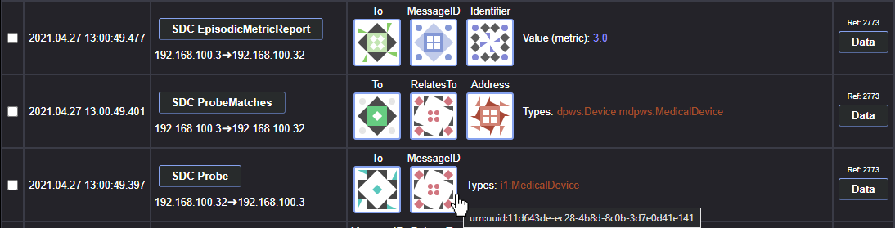

# SDC Log Explorer

## Introduction
ISO/IEEE 11073 service-oriented device connectivity (SDC) is a new standard for manufacturer-independent medical device-to-device interoperability. To analyse the workflow and track errors during patient treatment, it is important to securely protect the data from tampering, deletion and access by unauthorized third parties. This project uses an eco-friendly blockchain technology and public key encryption to handle the security concerns.


The whole project **SDC Blockchain Logger** is open source and consists of three applications for different tasks:
- [**SDC Log Explorer**](https://github.com/KevinTuncer/sdc-log-explorer) to display, filter and browse through the log.
- [**SDC Sniffer**](https://github.com/KevinTuncer/sdc-sniffer) to sniff SDC messages between medical devices. 
- [**SDC Data Safe**](https://github.com/KevinTuncer/sdc-data-safe) to handle permissions and storage on blockchain.

## Log Explorer
With this tool you can download SDC log entries from the blockchain and browse through it. Various filters can be applied and selected entries can be exported as PDF.

## Setup
1. Install [Node.js](https://nodejs.org) (Tested with LTS version 14.17.5).
2. Download all modules
```properties
npm install
```
3. Build the application
```properties
npm run build
```
Now you can start the index.html in the dist folder a modern web browser.

Alternative to building the application:

Start in dev mode
```properties
npm run serve
```

# Usage
## Login
The following login page will appear after starting the application. Enter the connection data and the key of a user with reading permission. For setting them up see [**SDC Sniffer**](https://github.com/KevinTuncer/sdc-sniffer).

- Endpoint is the URL to an endpoint of the blockchain. If the blockchain is running locally with standard settings it might be _http://localhost:8888/_ or for an endpoint of the kylin test net blockchain _https://api-kylin.eosasia.one_.
- Contract is the eosio name where the contract is deployed.
- Scope and sniffer are further names to choose the demanding log.
- Decryption key and passphrase are the private PGP key and related passphrase of a user with reading permission. Note: The public key has to be registered on the blockchain contract before the sniffer uploads new data.
Extra: In a later version, the user data can be replaced by a signature provider like a third party software application or a hardware device like an USB stick or a chip card.

Tipp for developers: By entering **default test** in the endpoint input and clicking **Connect**, predefined default parameters will be filled.

## View the log
After login you can download the log. By default, the logs will be automatically decrypted. Above are the connection and encryption properties listed, followed by an action bar and a table. There are also collapsible and expandable tabs for advanced and filter settings.

Click **Get current log** to get the actual last uploaded log until the last request, otherwise click **Get further logs** to download logs of the past. 
If there are constantly new uploaded logs you can activate the *Auto update* function in the **Advanced Settings**.

As you can see in the image of an example log, there are logged SDC messages of medical devices and messages of a workstation in the network. Each entry represents one message.


The shown log is presented in a fast readable way. Typically, long character sequences are shown as unic images (identicons) to easily differ between them with human eyes. Like in the image below: After a device sends a _"SDC Probe"_ message another device responses with a _"SDC ProbeMatches"_ message. The identicons of the parameters _"RelatesTo"_ and _"MessageID"_ are identical, because both are relying on the same value _"urn:uuid:11d643de-ec28-4b8d-8c0b-3d7e0d41e141"_. By hovering or clicking an identicon the value will be displayed.



## Filtering
By using the filter settings, you can activate several filters. The filters have two modes. One mode shows only messages which match the condition. By switching a toggle all messages which match the condition will be hidden. Click **Add** or **X** to add or remove a filter. By clicking in the inputs, suggestions of all possible entries for the downloaded log are shown. 


Active filters are shown in a status bar, even if you collapse the filter settings.


## Export
By using several filters, selecting some entries, using other filters and selecting some other entries, you can export the desired entries as you want. For that use the checkbox _"Show only selected"_ and _"Print View"_ and the button **Export as PDF**. 

In the following image is an example of a selected workflow presented. From bottom to top, it begins by a workstation event to set the value of a medical device to _100_. The workstation sends the command via a SDC message. The medical device answers with several SDC messages which contains the state of the value changing. At the end the workstation asks again for the state and get its response of the desired value.


# Usability tests
The log explorer completed one iteration of usability tests with 6 test persons of the environment of medical technology. The test persons were predominantly satisfied with the usability of the log explorer and their suggestions for improvement contributed to the further development of the software.

The summary test results and key statements about user perception are shown in the following figure. The average efficiency and effectiveness achieved were positive and a learning effect was observed.


# Licence
The whole project is open source and free to use, see MIT licence. If you want to work on this project, feel free to contact me or push some improvements.